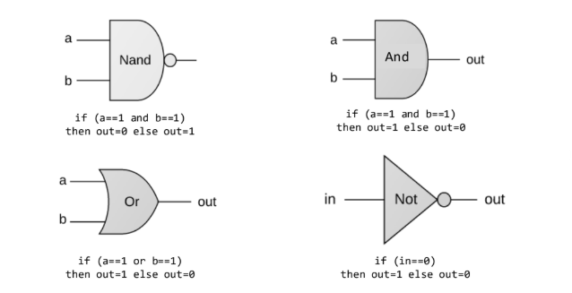
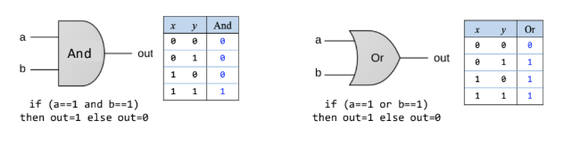
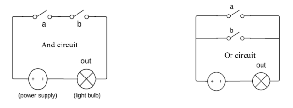
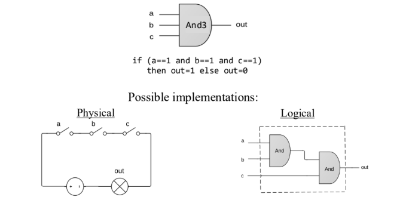

Here: https://drive.google.com/file/d/1MY1buFHo_Wx5DPrKhCNSA2cm5ltwFJzM/view
# Chapter 1: Boolean logic
## Theory
### Basic concepts
| x | y | x AND y | x NAND y | x OR y | x XOR y | x f y |
|---|---|---------|----------|--------|---------|-------|
| 0 | 0 |    0    |    1     |   0    |    0    |   ?   |
| 0 | 1 |    0    |    1     |   1    |    1    |   ?   |
| 1 | 0 |    0    |    1     |   1    |    1    |   ?   |
| 1 | 1 |    1    |    0     |   1    |    0    |   ?   |

### The expressive power of Nand

| Cổng logic | Công thức | Biểu diễn bằng NAND | Ý nghĩa |
|---|---|---|---|
| NOT | ¬x | x NAND x | Đảo giá trị của x |
| AND | x ∧ y | NOT(x NAND y) | Chỉ true khi cả x và y đều true |
| OR | x ∨ y | NOT(NOT(x) AND NOT(y)) | True khi ít nhất một biến true |
| OR (viết hoàn toàn bằng NAND) | x ∨ y | (x NAND x) NAND (y NAND y) | Dùng De Morgan để chuyển thành NAND |

#### Định lý
**Mọi hàm Boolean đều có thể được thực hiện chỉ bằng các cổng NAND.**

#### Chứng minh
- Mọi **hàm Boolean** đều có thể được biểu diễn bằng một **bảng chân trị (truth table)**.  
- Mọi **bảng chân trị** đều có thể được biểu diễn thành một **hàm Boolean** chỉ sử dụng các phép **NOT, AND và OR**  
  (được tổng hợp dưới dạng **DNF – Disjunctive Normal Form**, tức **dạng chuẩn tuyển**).

- Từ các quan sát trước đó:
  - **NOT** có thể xây bằng **NAND**
  - **AND** có thể xây bằng **NAND**
  - **OR** có thể xây bằng **NAND**

⇒ Do đó, **mọi hàm Boolean đều có thể được thực hiện chỉ bằng các cổng NAND**.

**Q.E.D.** *(Quod Erat Demonstrandum – điều cần chứng minh).*
#### Định lý
**Mọi hàm Boolean đều có thể được thực hiện chỉ bằng các cổng NAND.**

#### Hệ quả (Implication)
**Mọi máy tính đều có thể được xây dựng chỉ từ các cổng NAND.**

---

Vậy là về mặt lý thuyết, **chúng ta có thể xây dựng cả một máy tính chỉ từ các cổng NAND**.

Nhưng...

**Làm thế nào để thực sự làm được điều đó?**

Đó chính là nội dung của khóa học **Nand to Tetris**.
## Practice
### Logic gates
#### Elementary gates (Nand, And, Or, Not, ...)

#### Vì sao tập trung vào những cổng logic này?

- Vì **{NAND}** hoặc **{AND, OR, NOT}** (cũng như một số tập con khác của các toán tử Boolean)  
  **đủ để biểu diễn bất kỳ hàm Boolean nào**.
- Vì các cổng này **có cách triển khai phần cứng trực tiếp và hiệu quả**.

Triển khai mạch (mang tính khái niệm):

- Khóa học này **không bàn về các triển khai vật lý**  
- (mạch điện, transistor, ... đó là lĩnh vực **Điện – Điện tử (EE)**, không phải **Khoa học Máy tính (CS)**)  
- Chúng ta sẽ **tập trung vào các triển khai ở mức logic**.
# Đã học tới 35/103 (Xóa dòng này khi vào học lần tới)
## Project 1
